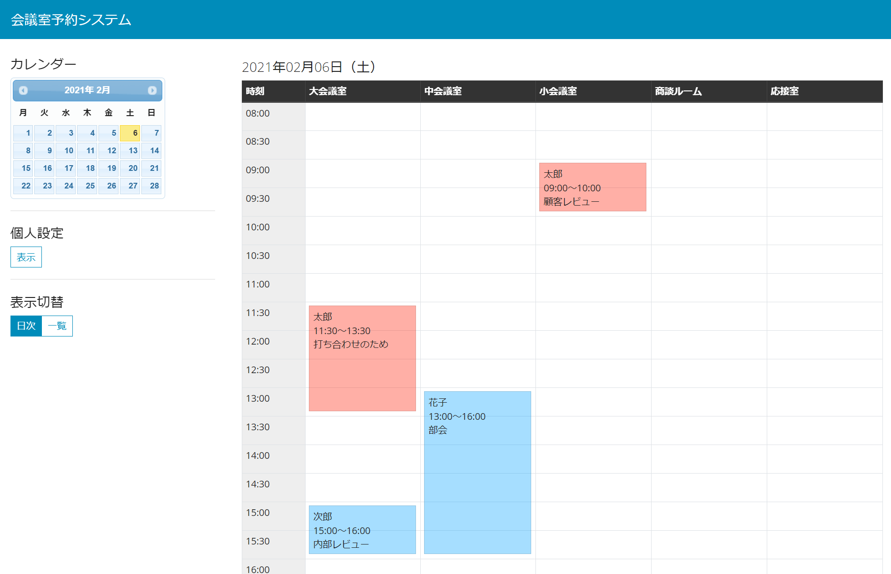
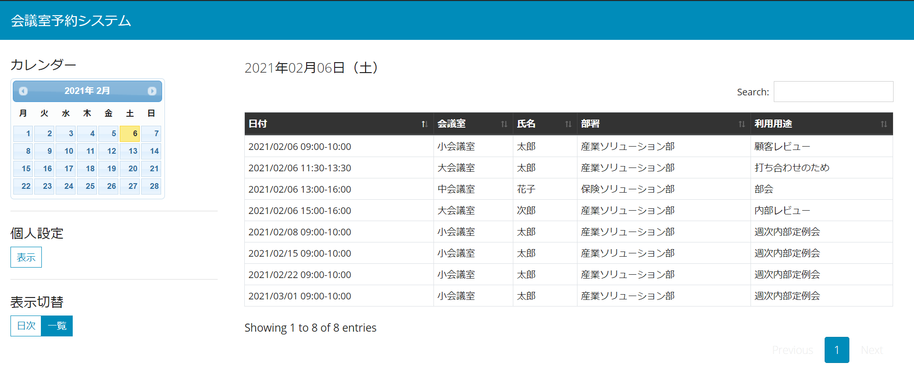
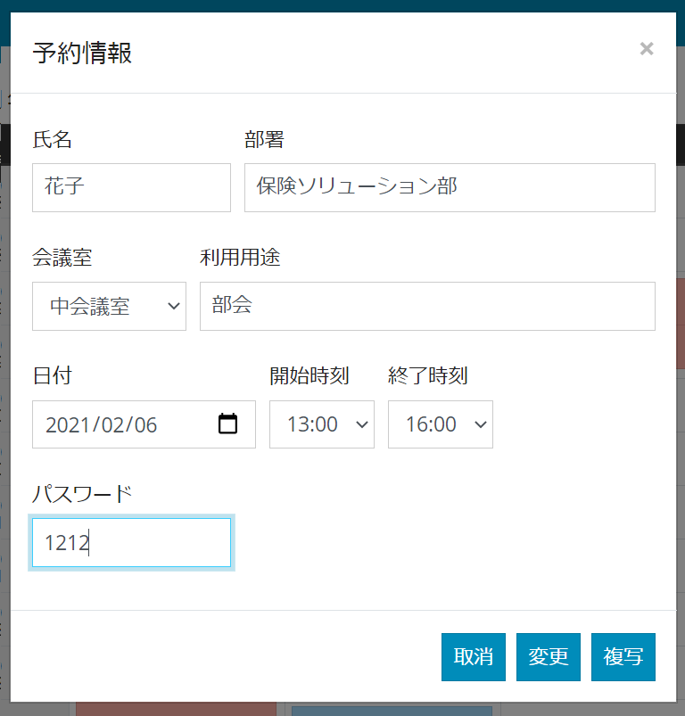
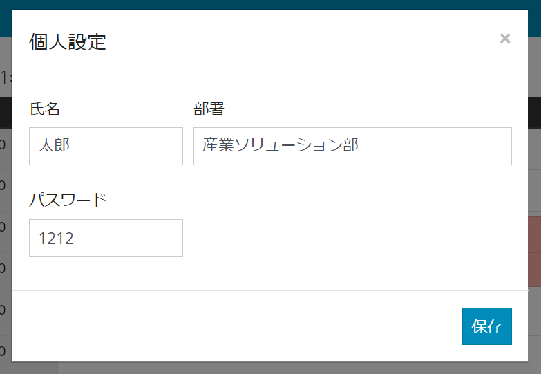

# 会議室予約システム 設計書

## システム概要

会議室を予約するシステム

## システム構成

| 種類               | 内容                                | 備考                              |
| ------------------ | ----------------------------------- | --------------------------------- |
| サーバ             | CentOS                              |                                   |
| 開発言語           | Javascript, HTML, CSS, SQL          |                                   |
| 開発フレームワーク | Node.js, Express, JQuery, BootStrap | いつか JQuery ⇒ Vue.js に変更予定 |
| データベース       | SQLite                              | https://www.sqlite.org/index.html |
| その他             | MDWiki                              | 設計書、マニュアルに利用          |

## 画面設計

### 日次スケジュール画面

### 一覧スケジュール画面

### 予約登録画面

### 個人設定画面

## Rest API 設計

### API 一覧

| URL                  | メソッド | 説明               | パラメータ         | 戻り値       |
| -------------------- | -------- | ------------------ | ------------------ | ------------ |
| /api/reserves/search | GET      | 予約情報一覧の取得 | 検索条件           | 予約情報一覧 |
| /api/reserve/{id}    | GET      | 予約情報の取得     | 予約 ID            | 予約情報     |
| /api/reserve         | POST     | 予約情報の登録     | 予約情報           | 登録結果     |
| /api/reserve         | PUT      | 予約情報の更新     | 予約情報           | 更新結果     |
| /api/reserve         | DELETE   | 予約情報の削除     | 予約 ID,パスワード | 削除結果     |
| /api/rooms           | GET      | 会議室一覧の取得   | -                  | 会議室一覧   |

## DB 設計

### テーブル一覧

| テーブル名     | テーブル ID    | 説明                               |
| -------------- | -------------- | ---------------------------------- |
| 会議室予約情報 | t_room_reserve | 会議室の予約情報を保持するテーブル |
| 会議室マスタ   | m_room         | 会議室を管理するマスタ             |

### 会議室予約情報（t_room_reserve）

| 項目名     | 項目 ID    | 型      | PK  | 必須 | 備考                  |
| ---------- | ---------- | ------- | --- | ---- | --------------------- |
| 予約 ID    | id         | INT     | 1   | 〇   | Auto Increment        |
| 氏名       | user_nm    | VARCHAR |     |      |                       |
| 部署名     | dept_nm    | VARCHAR |     |      |                       |
| 用途       | reason     | VARCHAR |     |      |                       |
| 会議室 ID  | room_id    | INT     |     | 〇   |                       |
| 開始時刻   | start_time | VARCHAR |     | 〇   | yyyy/mm/dd hh24:mi:ss |
| 終了時刻   | end_time   | VARCHAR |     | 〇   | yyyy/mm/dd hh24:mi:ss |
| パスワード | password   | VARCHAR |     |      |                       |
| 登録日付   | ins_date   | VARCHAR |     |      | yyyy/mm/dd hh24:mi:ss |
| 更新日付   | upd_date   | VARCHAR |     |      | yyyy/mm/dd hh24:mi:ss |
| 削除フラグ | del_flg    | INT     |     | 〇   | 0:未削除 1:削除済     |

### 会議室マスタ(m_room)

| 項目名     | 項目 ID  | 型      | PK  | 必須 | 備考                  |
| ---------- | -------- | ------- | --- | ---- | --------------------- |
| 会議室 ID  | room_id  | INT     | 1   | 〇   |                       |
| 会議室名   | room_nm  | VARCHAR |     | 〇   |                       |
| 表示順     | sort     | INT     |     |      |                       |
| 登録日付   | ins_date | VARCHAR |     |      | yyyy/mm/dd hh24:mi:ss |
| 更新日付   | upd_date | VARCHAR |     |      | yyyy/mm/dd hh24:mi:ss |
| 削除フラグ | del_flg  | INT     |     | 〇   | 0:未削除 1:削除済     |
