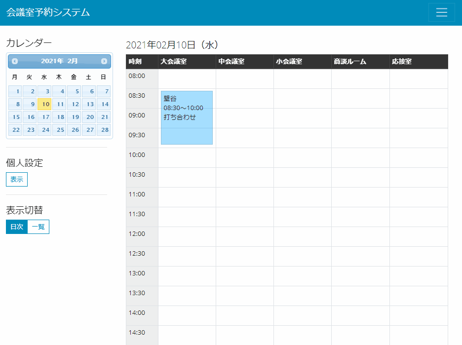
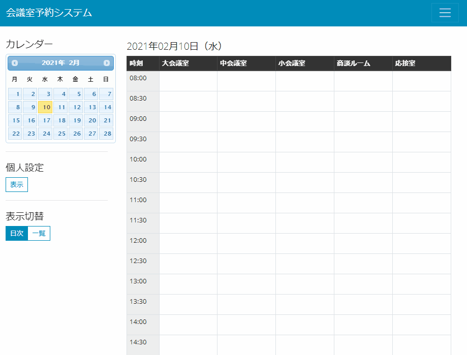
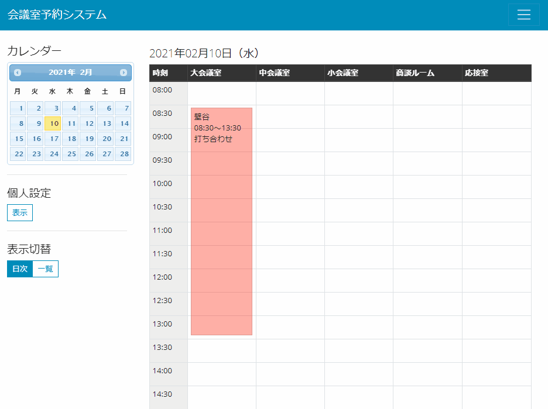
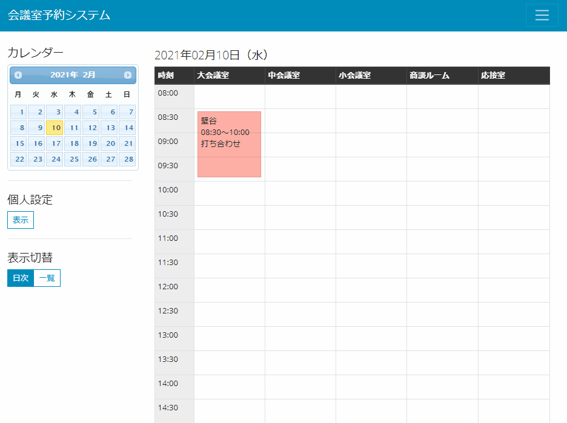

# 会議室予約システム マニュアル

## 個人設定

個人設定の表示ボタンをクリックします。
内容を入力して保存ボタンをクリックすると個人設定が保存されます。
　※個人設定は必須ではありませんが、設定しておくと色々な場面で便利です。

## 予約登録

予約したい会議室列の時刻をスケジュールをドラッグ＆ドロップします。
その後は内容を入力して登録ボタンをクリックすると予約情報が登録されます。
　※事前に個人設定を行っておくと「氏名」「部署」「パスワード」が初期値として設定されます。

## 予約変更・取消・複写

予約変更・取消・複写したい予約情報をクリックします。
その後は内容を修正と予約登録時のパスワードを入力して変更ボタンをクリックすると予約情報が変更されます。
取消の場合は取消ボタンをクリックします。予約情報が削除されます。
複写の場合は複写ボタンをクリックします。新しい予約情報として登録されます。
　※事前に個人設定を行っておくと、自身の予約情報の場合は「パスワード」が初期値として設定されます。

## 予約一覧参照

表示切替の一覧ボタンをクリックすると当日以降の全予約情報が表示されます。
予約一覧から予約情報をクリックして変更・取消・複写することも可能です。

## その他

* 会議室が追加・変更・削除となる場合は DB 修正が必要となるため管理者(xxxxx)に連絡してください。