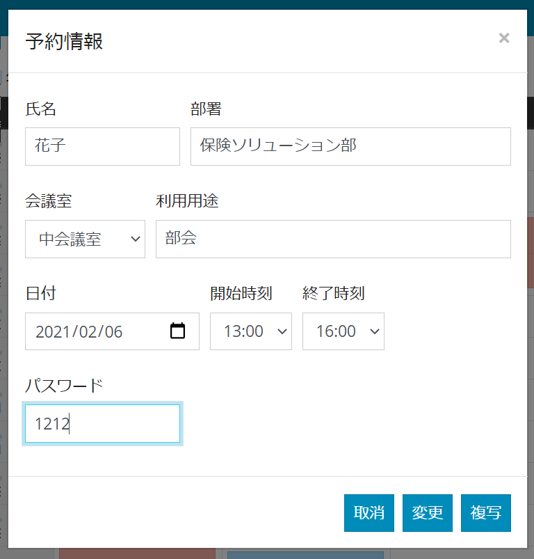
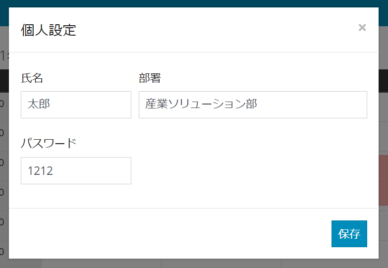

# 会議室予約システム 設計書

## システム概要
会議室を予約するシステム。
アクセスURL：http://localhost:3000/reserve-room.html

## システム設計

| 種類               | 内容                                                      | 備考                              |
| ------------------ | --------------------------------------------------------- | --------------------------------- |
| サーバ             | CentOS                                                    |                                   |
| 開発言語           | Javascript, SQL, HTML,  CSS                               |                                   |
| 開発フレームワーク | Javascript：Node.js, Express,  JQuery CSS：BootStrap |                                   |
| データベース       | SQLite                                                    | https://www.sqlite.org/index.html |

## 画面設計

#### スケジュール画面

#### 予約情報登録画面

#### 予約情報一覧画面

未作成

#### 個人設定画面

## Rest API設計

| URL                                      | メソッド | 説明               | パラメータ          | 戻り値           |
| ---------------------------------------- | -------- | ------------------ | ------------------- | ----------------|
| /reserves/search | GET | 予約情報一覧の取得 | 検索条件 | 予約情報一覧 |
| /reserves/{id}   | GET      | 予約情報の取得       | 予約ID            | 予約情報     |
| /reserve                                 | POST     | 予約情報の登録     | 予約情報            | 登録結果 |
| /reserve                                 | PUT      | 予約情報の更新     | 予約情報            | 更新結果 |
| /reserve       | DELETE   | 予約情報の削除     | 予約ID,パスワード | 削除結果            |
| /rooms                                   | GET      | 会議室一覧の取得   | -                   | 会議室一覧       |
| /setting | GET | その他設定情報の取得 | - | 設定情報 |

## DB設計

#### 1. テーブル一覧

| テーブル名     | テーブルID   | 説明                               |
| -------------- | ------------ | ---------------------------------- |
| 会議室予約情報 | t_room_reserve  | 会議室の予約情報を保持するテーブル |
| 会議室マスタ   | m_room       | 会議室を管理するマスタ |

#### テーブル定義：会議室予約情報（t_room_reserve）

| 項目名     | 項目ID     | 型       | PK   | 必須 | 備考                  |
| ---------- | ---------- | -------- | ---- | ---- | --------------------- |
| 予約ID   | id        | INT      | 1    | 〇   | Auto Increment        |
| 氏名       | user_nm    | VARCHAR |      |    |                       |
| 部署名     | dept_nm    | VARCHAR |      |    |                       |
| 用途       | reason     | VARCHAR |      |    |                       |
| 会議室ID   | room_id    | INT  |      | 〇   |                       |
| 開始時刻   | start_time | VARCHAR |      | 〇   | yyyy/mm/dd hh24:mi:ss |
| 終了時刻   | end_time   | VARCHAR |      | 〇   | yyyy/mm/dd hh24:mi:ss |
| パスワード | password   | VARCHAR  |      |    |                       |
| 登録日付   | ins_date   | VARCHAR |      |    | yyyy/mm/dd hh24:mi:ss |
| 更新日付   | upd_date   | VARCHAR |      |    | yyyy/mm/dd hh24:mi:ss |
| 削除フラグ | del_flg    | INT |      | 〇   | 0:未削除 1:削除済        |

#### テーブル定義：会議室マスタ(m_room)

| 項目名     | 項目ID   | 型      | PK   | 必須 | 備考                  |
| ---------- | -------- | ------- | ---- | ---- | --------------------- |
| 会議室ID   | room_id  | INT     | 1    | 〇   |                       |
| 会議室名   | room_nm  | VARCHAR |      | 〇   |                       |
| 表示順     | sort     | INT     |      |      |                       |
| 登録日付   | ins_date | VARCHAR |      |      | yyyy/mm/dd hh24:mi:ss |
| 更新日付   | upd_date | VARCHAR |      |      | yyyy/mm/dd hh24:mi:ss |
| 削除フラグ | del_flg  | INT     |      | 〇   | 0:未削除 1:削除済     |
